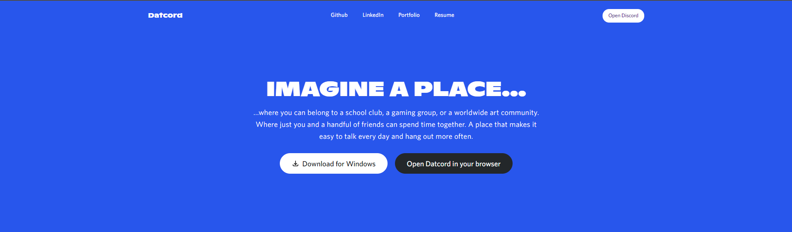
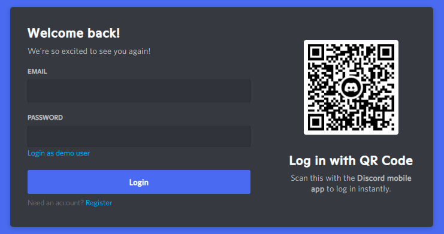

# Datcord

[Datcord](https://ea-datcord.herokuapp.com/#/) is a clone of the VoIP, instant messaging, and digital distribution platform, [Discord](https://discord.com). On Datcord, users can create and join communities called "servers" to chat with other users in those servers or have private conversations between friends on the app.

<p align="center">
  
</p>

## Technologies Used
***
*Backend:*
- Ruby on Rails

*Frontend:*
- React-Redux

*Database:*
- PostgreSQL

*Live Chat:*
- ActionCable/WebSockets

*Future technologies to be implemented:*
- AWS
- SendGrid

## Features
***

### **User Auth**

Users can create new accounts which they can use to log in and out of Datcord. On successful login, they will be routed to the main app. On unsuccessful login, errors will be displayed in red. A demo user is provided so that users can browse the site without having to create an account themselves.

<p align="center">
  
</p>

### **Live Chat**

Users can talk to other users on the app in real-time using Live Chat implemented with Action Cable/WebSockets. Messages sent in either a server or private conversation will be "subscribed" to through Action Cable and then have the sent messages from users "broadcasted" to the respective subscriptions.

```js
// frontend/components/message/ChatRoom.jsx

componentDidMount () {
  App.cable.subscriptions.create(
    { channel: "ChatChannel" },
    {
      received: data => {
        switch (data.type) {
          case "message":
            this.props.receiveMessage(data.message);
            break;
          case "messages":
            this.props.receiveMessages(data.messages);
            break;
        }
      },
      speak: function(data) {return this.perform("speak", data)},
      load: function() {return this.perform("load")}
    }
  )

  App.cable.subscriptions.subscriptions[0].load();
}
```

```js
// frontend/components/message/chat_room_container.js

const mSTP = (state, ownProps) => ({
  currentUser: state.session.id,
  messages: filterMessages(state, ownProps)
})

const mDTP = dispatch => ({
  receiveMessages: messages => dispatch(receiveMessages(messages)),
  receiveMessage: message => dispatch(receiveMessage(message)),
  removeMessage: message => dispatch(removeMessage(message))
});

export default connect(mSTP, mDTP)(ChatRoom);
```

## Future Features
***

- Error handling to mimic the actual experience from Discord
- More robust live chat (timestamps)
- More CRUD functionality for servers, channels, messages, and users (settings)
- Allowing users to upload their own avatars (using AWS)
- Allow users to add friends so they can start new DMs (direct messaging with Live Chat)
- Send users an email to "verify" their accounts for Datcord (using SendGrid)
